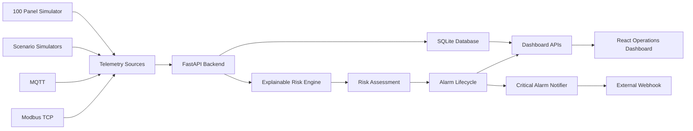

# GridGuard

**GridGuard** is a prototype edge monitoring and early-warning platform for low-voltage electrical distribution panels.

The system collects telemetry from simulated or industrial-style data sources, evaluates panel conditions with an explainable risk engine, manages alarm lifecycles, stores operational history, and presents the system state through a live React operations dashboard.

> GridGuard is an educational/prototype system. Risk thresholds used by the project are demonstration configuration values and must not be interpreted as universal electrical safety limits.

---

## Overview

GridGuard monitors electrical panel telemetry such as:

- Current
- Cable temperature
- Ambient temperature
- Humidity
- Partial discharge index
- Arc detection
- Data quality

Each telemetry record is processed by the GridGuard risk engine.

The engine produces:

- Risk score: `0 - 100`
- Operational status
- Primary risk category
- Explainable causes
- Component risk scores
- Derived metrics

Supported operational states:

- `NORMAL`
- `WARNING`
- `HIGH`
- `CRITICAL`

---

## Main Features

### Explainable Risk Engine

GridGuard evaluates multiple risk dimensions:

- Current anomalies
- Thermal conditions
- Environmental conditions
- Partial discharge degradation
- Arc-flash detection

The engine does not only return a score. It also explains why a panel received its current risk classification.

Example:

```text
Risk Score   : 75
Status       : CRITICAL
Primary Risk : THERMAL

Causes:
- Current increased more than 20% above recent baseline.
- Cable temperature is extremely high.
- Cable-to-ambient thermal delta is very high.
- Severe thermal escalation pattern detected.
```

---

### Thermal Escalation Detection

The system evaluates:

- Absolute cable temperature
- Cable-to-ambient temperature difference
- Cable temperature trend
- Stability of ambient temperature
- Recent current behavior

A severe thermal escalation pattern can raise a panel directly to a critical state.

---

### Partial Discharge Monitoring

GridGuard uses a normalized prototype partial-discharge index to detect:

- Elevated PD activity
- Rising PD trends
- Severe PD escalation

The PD index is a demonstration metric and is not presented as a calibrated physical measurement unit.

---

### Arc-Flash Detection

Arc detection is treated as a direct safety-critical signal.

When an arc event is detected:

```text
Risk Score   : 100
Status       : CRITICAL
Primary Risk : ARC_FLASH
```

The system does not wait for historical trend analysis before escalating an arc event.

---

### Alarm Lifecycle

GridGuard automatically manages alarms.

```text
NORMAL
   ↓
WARNING / HIGH / CRITICAL
   ↓
OPEN ALARM
   ↓
Panel recovers
   ↓
RESOLVED ALARM
```

Alarm history remains available after recovery for later inspection.

---

### Live Operations Dashboard

The React dashboard provides:

- System health
- Connected panel count
- Active alarm count
- Risk distribution
- Highest-risk panels
- Panel monitoring table
- Search and status filtering
- Alarm center
- Panel detail inspection
- Live telemetry
- Explainable risk information
- Current history
- Temperature history
- Risk-score history

Dashboard data is automatically refreshed.

---

## System Architecture



---

## Technology Stack

### Backend

- Python
- FastAPI
- Pydantic
- SQLAlchemy
- SQLite
- Uvicorn

### Frontend

- React
- Vite
- Axios
- Recharts

### Industrial / Messaging Integration

- MQTT
- Eclipse Mosquitto
- Paho MQTT
- Modbus TCP
- PyModbus

---

## Project Structure

```text
GridGuard/
│
├── backend/
│   └── app/
│       ├── main.py
│       ├── database.py
│       ├── models.py
│       └── schemas.py
│
├── frontend/
│   ├── src/
│   ├── package.json
│   └── package-lock.json
│
├── risk_engine/
│   ├── engine.py
│   └── test_engine.py
│
├── simulator/
│   ├── single_panel.py
│   ├── multi_panel.py
│   ├── scenario_overheating.py
│   ├── scenario_pd.py
│   ├── scenario_arc.py
│   └── scenario_recovery.py
│
├── integrations/
│   ├── mqtt_consumer.py
│   ├── modbus_server.py
│   ├── modbus_adapter.py
│   ├── notification_receiver.py
│   └── critical_notifier.py
│
├── data/
│
├── docs/
│
├── requirements.txt
├── .env.example
├── .gitignore
└── README.md
```

---

# Installation

## Requirements

Recommended development environment:

- Python 3.11+
- Node.js
- npm
- Git

Eclipse Mosquitto is required only for MQTT integration demonstrations.

---

## 1. Clone the Repository

```bash
git clone https://github.com/KenanAkyurek66/GridGuard.git
cd GridGuard
```

---

## 2. Create the Python Virtual Environment

### Windows PowerShell

```powershell
python -m venv .venv
.venv\Scripts\Activate.ps1
```

Install Python dependencies:

```powershell
python -m pip install -r requirements.txt
```

---

## 3. Install Frontend Dependencies

```powershell
cd frontend
npm ci
cd ..
```

---

# Running GridGuard

GridGuard normally uses separate terminals for the backend, frontend, and simulation tools.

---

## Terminal 1 — Backend

From the project root:

```powershell
.venv\Scripts\Activate.ps1
uvicorn backend.app.main:app --reload --no-access-log
```

Backend:

```text
http://127.0.0.1:8000
```

Swagger API documentation:

```text
http://127.0.0.1:8000/docs
```

Health endpoint:

```text
http://127.0.0.1:8000/health
```

---

## Terminal 2 — Frontend

```powershell
cd frontend
npm run dev
```

Dashboard:

```text
http://localhost:5173
```

---

## Terminal 3 — Simulator

Activate the Python environment if necessary:

```powershell
.venv\Scripts\Activate.ps1
```

Run the 100-panel simulator:

```powershell
python simulator\multi_panel.py
```

The simulator continuously generates telemetry for 100 virtual low-voltage panels.

Stop it with:

```text
Ctrl + C
```

---

# Demo Scenarios

GridGuard includes several controlled scenarios for demonstrating the risk engine.

## Overheating

```powershell
python simulator\scenario_overheating.py
```

The scenario gradually increases current and cable temperature.

Typical progression:

```text
NORMAL
   ↓
WARNING
   ↓
HIGH
   ↓
CRITICAL
```

A severe event reaches approximately:

```text
Risk Score   : 75
Status       : CRITICAL
Primary Risk : THERMAL
```

---

## Partial Discharge Degradation

```powershell
python simulator\scenario_pd.py
```

The PD index gradually increases and demonstrates degradation detection.

The final stage produces an elevated condition such as:

```text
Risk Score   : 50
Status       : HIGH
Primary Risk : PARTIAL_DISCHARGE
```

---

## Arc Flash

```powershell
python simulator\scenario_arc.py
```

An arc event immediately produces:

```text
Risk Score   : 100
Status       : CRITICAL
Primary Risk : ARC_FLASH
```

---

## Recovery

```powershell
python simulator\scenario_recovery.py
```

Recovery telemetry returns the target panel to:

```text
Risk Score : 0
Status     : NORMAL
```

Any associated open alarm is automatically resolved.

---

# REST API

Important endpoints include:

## System

```text
GET /
GET /health
```

## Telemetry

```text
POST /telemetry
GET /panels/{panel_id}/telemetry
```

## Risk

```text
GET /panels/{panel_id}/risk
GET /panels/{panel_id}/risks
```

## Alarms

```text
GET /alarms
GET /alarms?status=OPEN
GET /alarms?status=RESOLVED
```

## Dashboard

```text
GET /dashboard/summary
GET /dashboard/panels
GET /dashboard/panels/{panel_id}/detail
```

---

# MQTT Integration

GridGuard includes an MQTT telemetry consumer.

The local development configuration uses:

```text
Broker : 127.0.0.1
Port   : 1883
Topic  : gridguard/telemetry/#
```

Start Eclipse Mosquitto before running the consumer.

Run:

```powershell
python integrations\mqtt_consumer.py
```

Expected connection state:

```text
[MQTT CONNECTED]
[MQTT SUBSCRIBED]
Waiting for GridGuard telemetry...
```

GridGuard's MQTT consumer was also tested for broker outage and automatic reconnection.

---

# Modbus TCP Integration

GridGuard includes a simulated Modbus TCP device and an adapter that translates Modbus register data into GridGuard telemetry.

Start the simulated PLC:

```powershell
python integrations\modbus_server.py
```

Development endpoint:

```text
127.0.0.1:5020
```

Then run the adapter in another terminal:

```powershell
python integrations\modbus_adapter.py
```

Data flow:

```text
Modbus TCP
    ↓
GridGuard Modbus Adapter
    ↓
FastAPI /telemetry
    ↓
Risk Engine
    ↓
Database + Alarm System
```

---

# Critical Alarm Notifications

GridGuard can forward critical alarm events to an external webhook.

Start the local development notification receiver:

```powershell
python integrations\notification_receiver.py
```

Then run:

```powershell
python integrations\critical_notifier.py
```

The default development webhook is:

```text
http://127.0.0.1:9001/notify
```

An alternative webhook can be provided through the operating-system environment:

```powershell
$env:WEBHOOK_URL="http://example-host/notify"
python integrations\critical_notifier.py
```

The `.env.example` file documents this configuration.

> The current project does not automatically load `.env` files. `WEBHOOK_URL` is read from the process environment.

---

# Testing

## Core Risk Engine Regression Tests

Run:

```powershell
python -m risk_engine.test_engine
```

The regression suite verifies:

- Normal operation
- Moderate overheating
- Severe overheating
- Partial discharge degradation
- Severe partial discharge escalation
- Arc flash

Successful completion ends with:

```text
ALL CORE RISK ENGINE TESTS PASSED
```

---

## API Validation

GridGuard validates incoming telemetry using Pydantic.

Invalid telemetry is rejected with an HTTP `422` response.

Examples include impossible environmental measurements such as humidity values above the accepted range.

---

## Reliability Testing

The project has been tested for:

- Backend outage and frontend recovery
- MQTT broker outage and automatic reconnection
- Modbus server outage and recovery
- SQLite persistence after backend restart
- Alarm open/resolved lifecycle
- 100-panel continuous telemetry load
- Clean Python dependency installation
- Clean frontend dependency installation
- Production frontend build

---

# Production Build

Frontend:

```powershell
cd frontend
npm ci
npm run build
```

The generated production files are placed under:

```text
frontend/dist/
```

---

# Data Persistence

GridGuard uses SQLite for local persistence.

Runtime data is stored under:

```text
data/gridguard.db
```

Database files are intentionally ignored by Git.

A fresh database is created by the application when required, and demo telemetry can be generated using the included simulators.

---

# Risk Model Disclaimer

GridGuard is a software engineering prototype and demonstration platform.

Values used for:

- Current thresholds
- Temperature thresholds
- Thermal deltas
- Humidity thresholds
- Partial discharge thresholds
- Risk-score escalation

are **prototype/demo configuration values**.

They are not universal electrical protection settings and must not be used directly in a real installation.

A production deployment would require calibration according to:

- Asset type
- Cable specification
- Sensor characteristics
- Electrical design
- Protection equipment
- Site conditions
- Relevant engineering standards
- Qualified electrical engineering assessment

GridGuard should therefore be interpreted as a monitoring and software architecture prototype, not as a certified electrical protection system.

---

# Current Prototype Capabilities

GridGuard currently demonstrates an end-to-end pipeline:

```text
Telemetry
    ↓
Validation
    ↓
Persistent Storage
    ↓
Historical Analysis
    ↓
Explainable Risk Assessment
    ↓
Alarm Lifecycle
    ↓
Operations Dashboard
    ↓
Industrial / External Integrations
```

The platform supports 100 simulated distribution panels while retaining individual telemetry, risk, alarm, and trend histories.

---

# Repository

GitHub:

```text
https://github.com/KenanAkyurek66/GridGuard
```

---

## Author

**Kenan Akyurek**

Software Engineering Student

---

## Project Status

GridGuard is currently a completed functional prototype with:

- Backend API
- Explainable risk engine
- Persistent database
- Alarm management
- 100-panel simulation
- React operations dashboard
- MQTT integration
- Modbus TCP integration
- External critical-event notifications
- Reliability and regression testing