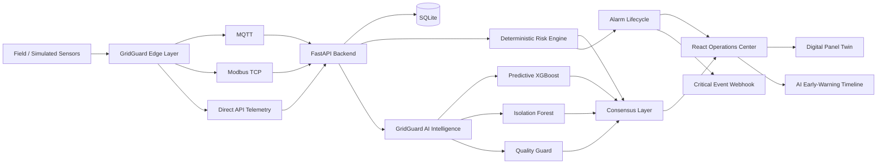
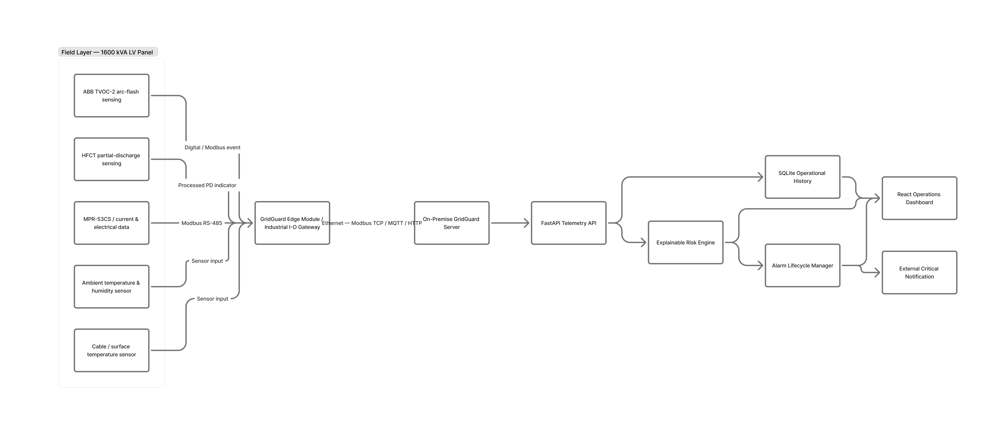

# GridGuard

**GridGuard** is an intelligent edge-monitoring and early-warning prototype for low-voltage electrical distribution panels.

It combines:

- deterministic and explainable risk analysis,
- predictive machine learning,
- behavioral anomaly detection,
- telemetry quality protection,
- alarm lifecycle management,
- industrial-style MQTT and Modbus integration,
- a live React Operations Center,
- an AI Early-Warning Timeline,
- and a Digital Panel Twin.

GridGuard is designed as an **operator decision-support and early-warning platform**.

> **Important:** GridGuard is a software engineering prototype. It is not a certified electrical protection device, does not perform autonomous switching, and has not yet been validated in a real energized electrical-panel installation.

---

## Project Objective

Electrical-panel faults rarely begin only when a protection threshold is crossed.

Thermal deterioration, abnormal load behavior, partial-discharge activity, environmental stress, and sensor-quality problems can develop gradually.

GridGuard investigates whether these signals can be combined into an explainable monitoring system capable of:

1. observing panel telemetry,
2. detecting deterministic risk,
3. identifying unusual behavior,
4. estimating possible future escalation,
5. validating telemetry quality,
6. generating alarms,
7. and presenting the result clearly to an operator.

The system is designed around the principle:

```text
Monitor
   ↓
Understand
   ↓
Warn Early
   ↓
Support the Operator
```

---

# System Overview

GridGuard processes telemetry fields such as:

```text
current_a
cable_temperature_c
ambient_temperature_c
humidity_pct
pd_index
arc_detected
data_quality
```

Each telemetry sample enters a layered analysis pipeline:

```text
Telemetry
    ↓
Validation
    ↓
Persistent Storage
    ↓
Historical Context
    ↓
┌───────────────────────────────┐
│ Deterministic Risk Engine     │
│ Predictive AI                 │
│ Behavioral Anomaly Detection  │
│ AI Quality Guard              │
└───────────────────────────────┘
    ↓
GridGuard Consensus
    ↓
Alarm Lifecycle
    ↓
Operations Center
```

---

# Core Architecture



The proposed physical path is:

```text
Electrical Panel
      ↓
Field Sensors
      ↓
GridGuard Edge Module
      ↓
MQTT / Modbus / Ethernet
      ↓
GridGuard Server
      ↓
Deterministic Risk + AI
      ↓
Operations Center
```

The physical GridGuard Edge Module is currently a **conceptual hardware architecture**, while the end-to-end software pipeline is implemented as a functional prototype.

---

# Main Features

## 1. Explainable Deterministic Risk Engine

GridGuard evaluates multiple risk dimensions including:

- electrical current behavior,
- cable temperature,
- cable-to-ambient thermal difference,
- temperature trend,
- environmental conditions,
- partial-discharge activity,
- and arc detection.

The engine produces:

```text
Risk Score
Operational Status
Primary Risk
Causes
Component Scores
Derived Metrics
```

Supported states:

```text
NORMAL
WARNING
HIGH
CRITICAL
```

Current prototype thresholds:

```text
0–19    NORMAL
20–44   WARNING
45–74   HIGH
75–100  CRITICAL
```

These values are demonstration configuration values, not universal electrical safety limits.

---

## 2. Arc Detection Safety Path

Arc detection is treated as a direct deterministic critical event.

Example:

```text
Risk Score   : 100
Status       : CRITICAL
Primary Risk : ARC_FLASH
```

GridGuard does not wait for AI confirmation before reporting deterministic critical evidence.

---

## 3. Predictive AI

GridGuard includes an XGBoost model designed to estimate whether a panel may escalate to:

```text
HIGH
or
CRITICAL
```

within the next:

```text
5 telemetry cycles
```

while the panel is not already HIGH or CRITICAL.

The model is used only as an **advisory early-warning layer**.

It does not replace deterministic safety logic.

---

## 4. Predictive Model Validation

The AI model is currently trained and evaluated using synthetic prototype telemetry.

Dataset summary:

| Item | Value |
|---|---:|
| Synthetic scenarios | 3,000 |
| Telemetry rows | 128,598 |
| Early-warning eligible rows | 110,971 |
| Future escalation positives | 10,723 |
| Positive rate | 9.66% |
| Prediction horizon | 5 telemetry cycles |

Held-out synthetic XGBoost test performance:

| Metric | Result |
|---|---:|
| Accuracy | 95.33% |
| Precision | 68.77% |
| Recall | 94.92% |
| F1 | 79.76% |
| ROC-AUC | 0.9868 |
| PR-AUC | 0.8955 |

These metrics represent **synthetic prototype evaluation only**.

They must not be interpreted as validated real-world electrical-panel performance.

Detailed AI documentation:

```text
docs/AI_VALIDATION.md
```

---

## 5. Behavioral Anomaly Detection

GridGuard uses an Isolation Forest trained on healthy synthetic telemetry.

Its purpose is not to predict a specific fault.

Instead, it asks:

> Does the current panel behavior look unusual compared with learned healthy behavior?

Held-out synthetic evaluation:

```text
Healthy specificity      : 95.08%
Abnormal detection rate  : 73.22%
```

The anomaly result is treated as supporting evidence.

---

## 6. AI Quality Guard

Raw ML probability is not automatically treated as a confirmed warning.

GridGuard includes a Quality Guard that evaluates:

- telemetry reliability,
- recent prediction persistence,
- suspicious data,
- and consecutive predictive evidence.

Possible advisory decisions:

```text
SAFE
HOLD
ESCALATION
```

An unreliable telemetry spike can therefore produce:

```text
HOLD
```

rather than an immediate escalation.

The current synthetic Quality Guard stress suite contains:

```text
12 scenarios
12 passed
```

---

## 7. GridGuard Consensus

GridGuard combines several information layers:

```text
Deterministic Risk
        +
Predictive AI
        +
Behavioral Anomaly
        +
Data Quality
        ↓
GridGuard Consensus
```

The most important rule is:

> **AI cannot downgrade deterministic CRITICAL evidence.**

Example:

```text
Deterministic = CRITICAL
AI            = SAFE

Final safety state remains CRITICAL.
```

---

# AI Early-Warning Demonstration

GridGuard includes a controlled synthetic overheating scenario.

Example progression:

| Step | Current | Cable Temperature | Deterministic State |
|---|---:|---:|---|
| 1 | 320 A | 45°C | NORMAL |
| 2 | 340 A | 48°C | NORMAL |
| 3 | 370 A | 54°C | NORMAL |
| 4 | 400 A | 60°C | WARNING |
| 5 | 435 A | 68°C | WARNING |
| 6 | 470 A | 76°C | HIGH |
| 7 | 500 A | 82°C | CRITICAL |

In the current demonstration:

```text
Step 3
Deterministic Risk : NORMAL
Predictive AI      : Early-Warning Advisory

Step 4
Deterministic Risk : WARNING
```

Therefore, the supported prototype claim is:

> **In our synthetic overheating demonstration, GridGuard's predictive model issued an early-warning advisory one telemetry cycle before the deterministic risk engine crossed its WARNING threshold.**

The prediction horizon is five telemetry cycles.

This does **not** mean GridGuard always predicts events five cycles early.

---

# Digital Panel Twin

The GridGuard frontend includes a Digital Panel Twin designed to connect software telemetry with a conceptual electrical-panel path.

The visualized path is:

```text
Main Busbar
    ↓
Circuit Breaker
    ↓
Outgoing Feeder
    ↓
Cable / Load Area
```

The interface also visualizes:

- current condition,
- cable temperature,
- partial-discharge activity,
- arc detection,
- ambient condition,
- GridGuard Edge state,
- data quality,
- AI analysis,
- prediction state,
- and consensus.

The Digital Panel Twin is a **software visualization**.

It is not a validated digital twin of a real industrial installation.

---

# AI Early-Warning Timeline

The Panel Detail interface includes an AI Early-Warning Timeline.

It displays the relationship between:

```text
Predictive AI Probability
        vs.
Deterministic Risk Score
```

during a live telemetry session.

When predictive escalation occurs before the deterministic WARNING transition, the interface can display:

```text
EARLY WARNING CONFIRMED
AI led by 1 telemetry cycle
```

for the demonstrated sequence.

---

# Operations Center

The React frontend currently provides:

- system overview,
- panel health distribution,
- connected panel count,
- active alarm count,
- highest-risk panels,
- panel search,
- status filtering,
- alarm center,
- detailed panel inspection,
- live telemetry,
- deterministic risk explanation,
- GridGuard Intelligence,
- predictive probability,
- behavioral anomaly state,
- data-quality state,
- consensus,
- AI drivers,
- AI Early-Warning Timeline,
- current trend,
- temperature trend,
- risk-score trend,
- and Digital Panel Twin / Panel View.

Main navigation:

```text
Overview
Panel View
Alarms
Panels
```

---

# Alarm Lifecycle

GridGuard automatically maintains alarm state.

```text
NORMAL
   ↓
WARNING / HIGH / CRITICAL
   ↓
OPEN ALARM
   ↓
Condition changes
   ↓
Alarm updated
   ↓
Panel recovers
   ↓
RESOLVED ALARM
```

Resolved alarms remain available for historical review.

---

# Industrial-Style Integrations

## MQTT

GridGuard includes an MQTT telemetry consumer.

Development configuration:

```text
Broker : 127.0.0.1
Port   : 1883
Topic  : gridguard/telemetry/#
```

Conceptual path:

```text
Edge Device
    ↓
MQTT Broker
    ↓
GridGuard MQTT Consumer
    ↓
FastAPI
    ↓
Risk + AI
```

The client has also been tested for broker outage and reconnection behavior.

---

## Modbus TCP

GridGuard includes:

- a simulated Modbus TCP device,
- and a Modbus-to-GridGuard telemetry adapter.

Development endpoint:

```text
127.0.0.1:5020
```

Flow:

```text
PLC / Industrial Device
        ↓
Modbus TCP
        ↓
GridGuard Adapter
        ↓
FastAPI
        ↓
Risk + AI
```

---

## Critical Event Webhook

GridGuard can forward critical events to an external webhook.

Default local development endpoint:

```text
http://127.0.0.1:9001/notify
```

Preferred environment variable:

```powershell
$env:GRIDGUARD_WEBHOOK_URL="http://example-host/notify"
python integrations\critical_notifier.py
```

For backward compatibility, the notifier also accepts:

```text
WEBHOOK_URL
```

`GRIDGUARD_WEBHOOK_URL` takes precedence.

The project does not currently load `.env` files automatically.

---

# Proposed Hardware Architecture

The software prototype is supported by a conceptual hardware architecture.

A future GridGuard deployment could contain:

- current measurement interface,
- cable-temperature sensor,
- ambient temperature / humidity sensor,
- HFCT-style partial-discharge sensing chain,
- optical arc sensing,
- GridGuard Edge Module,
- Ethernet,
- RS-485 / industrial communication,
- local telemetry buffering,
- watchdog monitoring,
- and a DIN-rail enclosure.

Conceptual flow:

```text
Field Sensors
     ↓
GridGuard Edge Module
     ↓
Local Validation / Buffering
     ↓
MQTT / Modbus / Ethernet
     ↓
GridGuard Server
```

The hardware is not currently certified or field validated.

Detailed hardware document:

```text
docs/HARDWARE_CONCEPT.md
```

---

# Conceptual Engineering Diagrams

The repository contains the following hardware and system diagrams:

```text
docs/diagrams1/01_system_architecture.png
docs/diagrams1/02_panel_instrumentation_concept.png
docs/diagrams1/03_panel_layout_overlay.png
docs/diagrams1/04_sensor_io_map.png
docs/diagrams1/05_end_to_end_flow.png
```

Example:



---

# Technology Stack

## Backend

- Python
- FastAPI
- Pydantic
- SQLAlchemy
- SQLite
- Uvicorn

## AI / Machine Learning

- XGBoost
- scikit-learn
- Isolation Forest
- NumPy
- pandas
- joblib

## Frontend

- React
- Vite
- Axios
- Recharts

## Industrial / Messaging

- MQTT
- Eclipse Mosquitto
- Paho MQTT
- Modbus TCP
- PyModbus

---

# Project Structure

```text
GridGuard/
│
├── backend/
│   └── app/
│       ├── ai_service.py
│       ├── database.py
│       ├── main.py
│       ├── models.py
│       └── schemas.py
│
├── frontend/
│   ├── public/
│   ├── src/
│   │   ├── AiTimeline.jsx
│   │   ├── AlarmCenter.jsx
│   │   ├── App.jsx
│   │   ├── DigitalPanelTwin.jsx
│   │   ├── PanelDetail.jsx
│   │   └── PanelView.jsx
│   ├── package.json
│   └── package-lock.json
│
├── integrations/
│   ├── critical_notifier.py
│   ├── modbus_adapter.py
│   ├── modbus_server.py
│   ├── mqtt_consumer.py
│   └── notification_receiver.py
│
├── ml/
│   ├── models/
│   ├── reports/
│   └── ...
│
├── risk_engine/
│   ├── engine.py
│   └── test_engine.py
│
├── simulator/
│   ├── multi_panel.py
│   ├── scenario_arc.py
│   ├── scenario_overheating.py
│   ├── scenario_overheating_ai_trace.py
│   ├── scenario_overheating_demo.py
│   ├── scenario_pd.py
│   ├── scenario_recovery.py
│   └── single_panel.py
│
├── docs/
│   ├── AI_VALIDATION.md
│   ├── ARCHITECTURE.md
│   ├── DEMO_GUIDE.MD
│   ├── HARDWARE_CONCEPT.md
│   └── diagrams1/
│
├── data/
├── requirements.txt
├── .env.example
├── .gitignore
└── README.md
```

---

# Installation

## Requirements

Recommended development environment:

- Python 3.11+
- Node.js
- npm
- Git

Eclipse Mosquitto is required only for MQTT demonstrations.

---

## 1. Clone

```powershell
git clone https://github.com/KenanAkyurek66/GridGuard.git
cd GridGuard
```

---

## 2. Python Environment

Windows PowerShell:

```powershell
python -m venv .venv
.venv\Scripts\Activate.ps1
python -m pip install -r requirements.txt
```

---

## 3. Frontend Dependencies

```powershell
cd frontend
npm ci
cd ..
```

---

# Running GridGuard

A normal development session uses separate terminals.

## Terminal 1 — Backend

From the project root:

```powershell
.venv\Scripts\Activate.ps1
uvicorn backend.app.main:app --reload --no-access-log
```

Backend:

```text
http://127.0.0.1:8000
```

Swagger:

```text
http://127.0.0.1:8000/docs
```

Health:

```text
http://127.0.0.1:8000/health
```

AI runtime status:

```text
http://127.0.0.1:8000/ai/status
```

---

## Terminal 2 — Frontend

```powershell
cd frontend
npm run dev
```

Open:

```text
http://localhost:5173
```

---

## Terminal 3 — Development / Simulation

Example 100-panel simulation:

```powershell
python simulator\multi_panel.py
```

Stop with:

```text
Ctrl + C
```

---

# Recommended Jury Demonstration

For the primary overheating + predictive AI demonstration:

```powershell
python simulator\scenario_overheating_demo.py
```

Keep the target panel open in the frontend so that the AI Timeline can record live session transitions.

The key sequence is:

```text
NORMAL
   ↓
AI EARLY-WARNING ADVISORY
   ↓
WARNING
   ↓
HIGH
   ↓
CRITICAL
```

The jury-safe claim is:

> In our synthetic overheating demonstration, GridGuard's predictive model issued an early-warning advisory one telemetry cycle before the deterministic risk engine crossed its WARNING threshold.

---

# Additional Scenarios

## Deterministic Overheating

```powershell
python simulator\scenario_overheating.py
```

## AI Trace

```powershell
python simulator\scenario_overheating_ai_trace.py
```

## Partial Discharge

```powershell
python simulator\scenario_pd.py
```

## Arc Event

```powershell
python simulator\scenario_arc.py
```

## Recovery

```powershell
python simulator\scenario_recovery.py
```

---

# REST API

Important endpoints include:

## System

```text
GET /
GET /health
GET /ai/status
```

## Telemetry

```text
POST /telemetry
GET /panels
GET /panels/{panel_id}
GET /panels/{panel_id}/telemetry
```

## Deterministic Risk

```text
GET /panels/{panel_id}/risk
GET /panels/{panel_id}/risks
```

## AI Intelligence

```text
GET /panels/{panel_id}/intelligence
```

## Alarms

```text
GET /alarms
GET /alarms?status=OPEN
GET /alarms?status=RESOLVED
```

## Dashboard

```text
GET /dashboard/summary
GET /dashboard/panels
GET /dashboard/panels/{panel_id}/detail
```

Complete interactive API documentation is available through Swagger at:

```text
http://127.0.0.1:8000/docs
```

---

# MQTT Demonstration

Start Eclipse Mosquitto.

Then:

```powershell
python integrations\mqtt_consumer.py
```

Example telemetry source:

```powershell
python simulator\mqtt_single_panel.py
```

---

# Modbus TCP Demonstration

Start the simulated Modbus device:

```powershell
python integrations\modbus_server.py
```

Then run the adapter:

```powershell
python integrations\modbus_adapter.py
```

---

# Critical Notification Demonstration

Start the development receiver:

```powershell
python integrations\notification_receiver.py
```

Then:

```powershell
python integrations\critical_notifier.py
```

---

# Testing

## Deterministic Risk Engine

```powershell
python -m risk_engine.test_engine
```

Successful completion ends with:

```text
ALL CORE RISK ENGINE TESTS PASSED
```

---

## Frontend Production Build

```powershell
cd frontend
npm run build
```

Generated files:

```text
frontend/dist/
```

---

# Reliability and Prototype Testing

GridGuard has been exercised for scenarios including:

- deterministic normal operation,
- thermal escalation,
- partial-discharge escalation,
- arc detection,
- alarm opening,
- alarm updating,
- alarm resolution,
- backend restart and SQLite persistence,
- 100-panel simulation,
- MQTT connectivity and reconnection,
- Modbus communication interruption and recovery,
- AI predictive evaluation,
- anomaly detection,
- AI Quality Guard stress scenarios,
- frontend production build,
- and recovery from dangerous to normal operating state.

---

# Data Persistence

GridGuard uses SQLite for prototype persistence.

Runtime database:

```text
data/gridguard.db
```

Database files are ignored by Git.

A new database can be created automatically when required.

---

# Safety and Engineering Position

GridGuard should currently be described as:

> **A functional software prototype for intelligent low-voltage electrical-panel monitoring and early warning, supported by synthetic AI validation, industrial-style communication integrations, a conceptual edge-hardware architecture, and a virtual panel representation.**

GridGuard should **not** currently be described as:

- certified electrical protection equipment,
- a validated industrial safety device,
- an autonomous switching controller,
- or a field-proven fault-prediction system.

A real deployment would require:

- qualified electrical engineering review,
- real sensor integration,
- sensor calibration,
- electrical isolation validation,
- EMC testing,
- cybersecurity assessment,
- industrial environmental testing,
- field datasets,
- model recalibration,
- prospective field trials,
- and compliance with applicable standards.

---

# Documentation

Detailed project documentation:

- [AI Validation and Model Card](docs/AI_VALIDATION.md)
- [Hardware Concept](docs/HARDWARE_CONCEPT.md)
- [System Architecture](docs/ARCHITECTURE.md)
- [Demo Guide](docs/DEMO_GUIDE.MD)

---

# Current Prototype Status

Implemented:

- FastAPI backend
- telemetry validation
- SQLite persistence
- deterministic risk engine
- alarm lifecycle
- XGBoost predictive model
- Isolation Forest anomaly detector
- AI Quality Guard
- GridGuard Consensus
- AI explainability
- AI runtime API
- React Operations Center
- AI Early-Warning Timeline
- Digital Panel Twin
- 100-panel simulator
- overheating / PD / arc / recovery scenarios
- MQTT integration
- Modbus TCP integration
- external critical-event webhook
- conceptual hardware architecture
- synthetic AI validation documentation

Future work:

- physical GridGuard Edge Module
- real industrial sensors
- calibrated partial-discharge acquisition
- real optical arc sensor integration
- production edge buffering
- industrial enclosure
- electrical certification
- field data collection
- real-world AI validation
- long-duration pilot deployment

---

## Author

**Kenan Akyurek**

Software Engineering Student

---

## Repository

```text
https://github.com/KenanAkyurek66/GridGuard
```

---

## Disclaimer

GridGuard is an educational and engineering prototype.

All deterministic thresholds, synthetic datasets, model metrics, hardware concepts, and visualization behaviors are intended for prototype research and demonstration.

They must not be used directly as certified electrical safety settings or protection logic.