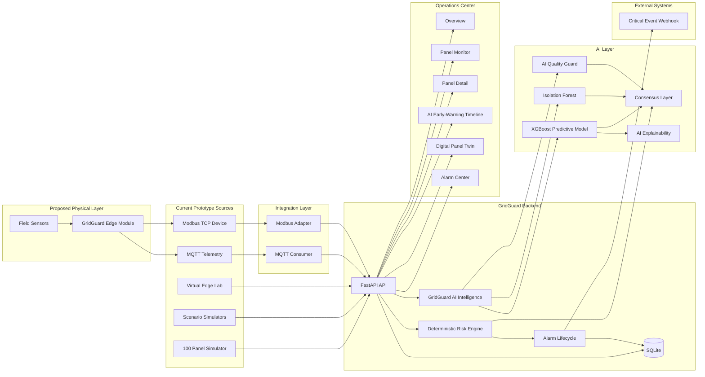
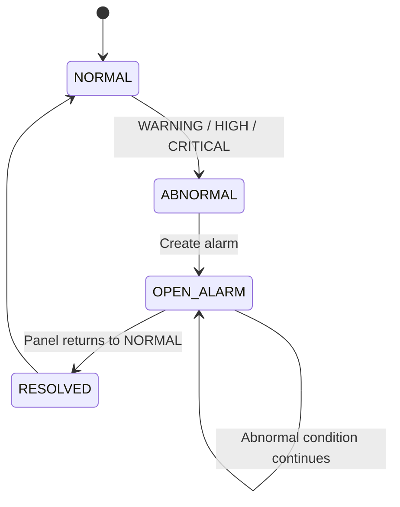

# GridGuard System Architecture

## 1. Purpose

GridGuard is an intelligent edge-monitoring and early-warning prototype designed for low-voltage electrical distribution panels.

The architecture demonstrates an end-to-end monitoring pipeline that combines:

- telemetry acquisition,
- industrial-style communication,
- API validation,
- persistent storage,
- historical analysis,
- deterministic risk assessment,
- predictive machine learning,
- behavioral anomaly detection,
- data-quality protection,
- consensus generation,
- alarm lifecycle management,
- live operational visualization,
- software-based virtual edge / hardware emulation,
- bilingual Turkish / English operator presentation,
- and external critical-event notification.

GridGuard is currently a **software engineering prototype** supported by a conceptual hardware architecture.

It is not a certified electrical protection device and does not perform autonomous switching.

---

## 2. Architectural Principles

GridGuard is built around several core principles.

### Deterministic Safety Priority

Strong deterministic safety evidence must not be suppressed by machine-learning output.

### AI as Advisory Intelligence

AI provides predictive and behavioral information but does not directly control electrical equipment.

### Explainability

Both deterministic and AI layers should provide understandable information to operators.

### Historical Context

Telemetry is analyzed as a sequence instead of treating every sample independently.

### Data Quality Awareness

Unreliable telemetry should reduce confidence rather than silently generate strong conclusions.

### Safe Degradation

Failure of AI, communication, or individual sensors should not silently create false certainty.

### Industrial Integration

The architecture supports common telemetry and industrial communication concepts such as MQTT and Modbus TCP.

---

## 3. High-Level Architecture



---

## 4. Physical Deployment Concept

The proposed future physical path is:

```text
Low-Voltage Electrical Panel
            ↓
        Field Sensors
            ↓
   GridGuard Edge Module
            ↓
Local Validation / Buffering
            ↓
 MQTT / Modbus / Ethernet
            ↓
      GridGuard Server
```

The GridGuard Edge Module is currently a **conceptual hardware component**.

The existing software prototype simulates or adapts telemetry that such a device could eventually provide.

The **Virtual Edge Lab** is the software-based prototype of this acquisition layer. It sends controlled telemetry scenarios to the real GridGuard backend and makes the edge-to-server data path observable without claiming to be validated production hardware.

Detailed hardware information is available in:

```text
docs/HARDWARE_CONCEPT.md
```

---

## 5. Telemetry Model

Each telemetry record represents observations associated with one monitored panel.

Current GridGuard telemetry includes:

```text
panel_id
timestamp
current_a
cable_temperature_c
ambient_temperature_c
humidity_pct
pd_index
arc_detected
data_quality
```

The main physical interpretations are:

| Field | Meaning |
|---|---|
| `current_a` | Electrical current |
| `cable_temperature_c` | Cable or conductor temperature |
| `ambient_temperature_c` | Panel ambient temperature |
| `humidity_pct` | Relative humidity |
| `pd_index` | Normalized prototype partial-discharge indicator |
| `arc_detected` | Arc-event detection state |
| `data_quality` | Trustworthiness of telemetry |

The current `pd_index` is a normalized prototype quantity and must not be interpreted as a calibrated physical PD unit.

---

## 6. Telemetry Ingestion Flow

The primary API ingestion path is:

```text
Telemetry Source
      ↓
POST /telemetry
      ↓
Pydantic Validation
      ↓
Raw Telemetry Persistence
      ↓
Panel State Update
      ↓
Historical Context
      ↓
Deterministic Risk Assessment
      ↓
Risk Persistence
      ↓
Alarm Synchronization
```

AI Intelligence is then available through the panel intelligence API using stored telemetry history and the latest deterministic risk assessment.

---

## 7. API Validation Layer

FastAPI and Pydantic validate incoming telemetry before it enters the main analysis pipeline.

Validation prevents structurally invalid telemetry from being accepted silently.

Invalid requests return an HTTP validation error such as:

```text
422 Unprocessable Entity
```

Validation is a software input-protection layer.

It does not replace physical sensor validation or industrial signal conditioning.

---

## 8. Persistence Layer

GridGuard uses SQLite through SQLAlchemy.

Primary entities are:

### Panel

Stores the latest known operational state of each panel.

### Telemetry

Stores historical telemetry samples.

### RiskAssessment

Stores deterministic risk-engine results.

### Alarm

Stores abnormal-condition events and lifecycle state.

Alarm states include:

```text
OPEN
RESOLVED
```

Historical telemetry, risk assessments, and resolved alarms remain available for later analysis.

---

## 9. Historical Context

Both deterministic and AI analysis use historical telemetry.

Records are supplied in chronological order:

```text
oldest → newest
```

Historical information enables analysis of behavior such as:

- current rise,
- temperature trend,
- thermal delta,
- partial-discharge progression,
- recovery,
- changing environmental conditions,
- and temporal ML features.

This is important because many developing conditions cannot be represented accurately by a single isolated sample.

---

# Deterministic Intelligence

## 10. Explainable Risk Engine

The deterministic risk engine is located under:

```text
risk_engine/
```

It evaluates multiple condition dimensions:

```text
Current
Thermal
Environment
Partial Discharge
Arc Detection
```

The engine returns:

```text
risk_score
status
primary_risk
causes
component_scores
metrics
```

Unlike an opaque single-score system, the deterministic layer provides explicit causes and component-level information.

---

## 11. Risk Classification

GridGuard currently uses four operational states:

```text
0–19    NORMAL
20–44   WARNING
45–74   HIGH
75–100  CRITICAL
```

These thresholds are prototype demonstration settings.

They are not universal electrical protection limits.

---

## 12. Thermal Analysis

Thermal risk considers information such as:

- absolute cable temperature,
- cable-to-ambient temperature difference,
- temperature trend,
- recent current behavior,
- and escalation patterns.

A developing overheating condition can therefore be identified using both absolute measurements and recent behavior.

---

## 13. Partial-Discharge Analysis

GridGuard evaluates the normalized prototype PD index for:

- elevated activity,
- increasing activity,
- and strong escalation patterns.

The current implementation demonstrates software analysis of PD-like telemetry.

It does not claim calibrated physical partial-discharge measurement.

---

## 14. Arc Safety Override

Arc detection is treated as immediate deterministic critical evidence.

Conceptually:

```text
Arc detected
     ↓
Risk Score = 100
     ↓
Status = CRITICAL
     ↓
Primary Risk = ARC_FLASH
```

The system does not wait for predictive AI confirmation.

This is an important architectural safety principle.

---

# AI Intelligence

## 15. GridGuard AI Layer

The AI subsystem is coordinated through:

```text
backend/app/ai_service.py
```

It provides:

- predictive escalation analysis,
- behavioral anomaly detection,
- telemetry quality protection,
- explainability information,
- and consensus information.

The AI layer is advisory.

---

## 16. Predictive Model

GridGuard uses XGBoost for predictive escalation analysis.

The predictive task is:

> Determine whether a panel is likely to escalate to HIGH or CRITICAL within the next five telemetry cycles while it is not already HIGH or CRITICAL.

Conceptual flow:

```text
Recent Telemetry
      ↓
Temporal Feature Engineering
      ↓
XGBoost
      ↓
Future Escalation Probability
      ↓
AI Quality Guard
      ↓
SAFE / HOLD / ESCALATION
```

The prediction horizon is:

```text
5 telemetry cycles
```

This does not mean that GridGuard always provides five cycles of advance warning.

---

## 17. Predictive Model Scope

The predictive model was trained and evaluated using synthetic prototype telemetry.

Current dataset:

```text
3,000 scenarios
128,598 telemetry rows
110,971 early-warning eligible rows
10,723 future escalation positives
```

The held-out synthetic test results are documented in:

```text
docs/AI_VALIDATION.md
```

These results must not be interpreted as validated field performance.

---

## 18. Behavioral Anomaly Detection

GridGuard uses Isolation Forest as an unsupervised anomaly-detection layer.

The detector is trained on synthetic healthy telemetry.

Its purpose is to answer:

```text
Does the current behavior differ from learned healthy behavior?
```

The anomaly detector does not identify a specific electrical fault.

It supplies additional behavioral evidence to the AI and consensus layers.

---

## 19. AI Quality Guard

A high model probability is not automatically treated as a valid escalation.

GridGuard includes a Quality Guard that considers:

- recent predictive probabilities,
- persistence across telemetry samples,
- and telemetry quality.

Conceptual decisions:

```text
SAFE
HOLD
ESCALATION
```

Example:

```text
Large model probability
        +
Telemetry marked unreliable
        ↓
HOLD
```

This helps prevent a single suspicious telemetry spike from immediately becoming a strong AI advisory.

---

## 20. AI Explainability

GridGuard exposes important predictive-model drivers to the operator.

Potential drivers include:

- current,
- cable temperature,
- cable-to-ambient thermal difference,
- partial-discharge behavior,
- humidity,
- trends,
- and rolling temporal features.

These drivers explain model contribution.

They must not automatically be interpreted as proof of physical causality.

---

# Consensus and Safety

## 21. GridGuard Consensus

The consensus layer combines several evidence sources.

```text
Deterministic Risk
        +
Predictive AI
        +
Behavioral Anomaly
        +
Data Quality
        ↓
GridGuard Consensus
```

Consensus helps the interface explain whether software layers agree or disagree.

Typical situations include:

- deterministic and AI evidence agree,
- predictive AI identifies deterioration before a deterministic threshold,
- anomaly evidence supports an abnormal condition,
- unreliable data causes AI evidence to be withheld,
- or deterministic critical evidence overrides AI disagreement.

---

## 22. Deterministic Critical Override

The most important AI safety rule is:

```text
Deterministic CRITICAL cannot be downgraded by AI.
```

For example:

```text
Deterministic Risk : CRITICAL
Predictive AI      : SAFE
```

The system must retain:

```text
CRITICAL
```

AI is not allowed to suppress strong deterministic safety evidence.

---

## 23. Safety Hierarchy

The conceptual hierarchy is:

```text
Certified Electrical Protection Equipment
                 ↓
Deterministic Safety Evidence
                 ↓
GridGuard Risk Engine
                 ↓
GridGuard AI Advisory
                 ↓
Operator Decision Support
```

GridGuard does not replace existing protection equipment.

---

# Alarm Architecture

## 24. Alarm Lifecycle

The backend synchronizes alarms with deterministic abnormal states.



The same incident is updated instead of creating a new alarm for every telemetry sample.

---

## 25. Alarm Persistence

When the panel returns to NORMAL:

```text
Existing OPEN Alarm
        ↓
resolved_at assigned
        ↓
status = RESOLVED
```

The alarm remains in the database for historical review.

---

# Backend API

## 26. Core API Responsibilities

The FastAPI backend coordinates:

- telemetry ingestion,
- validation,
- persistence,
- panel-state maintenance,
- deterministic risk evaluation,
- risk-history access,
- alarm management,
- dashboard APIs,
- AI runtime status,
- AI panel intelligence,
- and health monitoring.

---

## 27. Important Endpoints

### System

```text
GET /
GET /health
GET /ai/status
```

### Telemetry

```text
POST /telemetry
GET /panels
GET /panels/{panel_id}
GET /panels/{panel_id}/telemetry
```

### Deterministic Risk

```text
GET /panels/{panel_id}/risk
GET /panels/{panel_id}/risks
```

### AI Intelligence

```text
GET /panels/{panel_id}/intelligence
```

### Alarms

```text
GET /alarms
```

### Dashboard

```text
GET /dashboard/summary
GET /dashboard/panels
GET /dashboard/panels/{panel_id}/detail
```

Swagger documentation is provided through:

```text
http://127.0.0.1:8000/docs
```

---

# Frontend Architecture

## 28. Operations Center

The frontend uses React and Vite.

Main navigation:

```text
Overview
Panel View
Alarms
Panels
```

The frontend communicates with the FastAPI backend using Axios.

---

## 29. Overview

The Overview page presents system-level information such as:

- connected panels,
- active alarms,
- risk distribution,
- highest-risk panels,
- and general operational status.

---

## 30. Panel Monitor

The panel-monitoring interface supports:

- panel listing,
- search,
- status filtering,
- risk visibility,
- and detailed panel inspection.

---

## 31. Panel Detail

The panel detail interface exposes:

- current risk,
- primary risk,
- telemetry,
- deterministic explanations,
- active alarm information,
- GridGuard Intelligence,
- predictive probability,
- behavioral anomaly,
- data quality,
- consensus,
- AI drivers,
- AI Early-Warning Timeline,
- current history,
- temperature history,
- and risk-score history.

---

## 32. AI Early-Warning Timeline

The AI Timeline compares:

```text
Predictive AI Probability
        vs.
Deterministic Risk Score
```

during the current panel session.

The component stores recent samples while the panel remains open.

In the canonical synthetic overheating demonstration:

```text
Step 3
AI = Early-Warning Advisory
Deterministic = NORMAL

Step 4
Deterministic = WARNING
```

The interface can therefore report:

```text
EARLY WARNING CONFIRMED
AI led by 1 telemetry cycle
```

for that demonstrated sequence.

This is a demonstration-specific result, not a universal lead-time claim.

---

## 33. Digital Panel Twin

GridGuard includes a conceptual Digital Panel Twin.

The visualized electrical path is:

```text
Main Busbar
    ↓
Circuit Breaker
    ↓
Outgoing Feeder
    ↓
Cable / Load Area
```

The Panel Twin combines:

- live telemetry,
- risk state,
- sensor state,
- data quality,
- AI advisory status,
- and GridGuard Edge visualization.

It is intended to connect software information with conceptual physical panel areas.

It is not a validated physical digital twin of a real panel.

---

# Integration Architecture

## 34. MQTT Integration

GridGuard supports telemetry ingestion through MQTT.

Development path:

```text
MQTT Publisher
      ↓
Eclipse Mosquitto
      ↓
gridguard/telemetry/#
      ↓
GridGuard MQTT Consumer
      ↓
POST /telemetry
```

Local development configuration:

```text
Host  : 127.0.0.1
Port  : 1883
```

The MQTT consumer has been tested for broker interruption and reconnection.

---

## 35. Modbus TCP Integration

GridGuard includes a Modbus TCP demonstration layer.

```text
Simulated PLC
      ↓
Modbus TCP
      ↓
GridGuard Modbus Adapter
      ↓
Telemetry Translation
      ↓
POST /telemetry
```

Current local development endpoint:

```text
127.0.0.1:5020
```

The adapter converts Modbus values into the standard GridGuard telemetry schema.

---

## 36. Critical Event Webhook

Critical alarm events can be forwarded to an external webhook.

Flow:

```text
Alarm State
    ↓
Critical Alarm Notifier
    ↓
Webhook Endpoint
    ↓
External Notification System
```

Local development endpoint:

```text
http://127.0.0.1:9001/notify
```

Preferred environment variable:

```text
GRIDGUARD_WEBHOOK_URL
```

Legacy fallback:

```text
WEBHOOK_URL
```

The application does not currently load `.env` automatically.

The variable must therefore exist in the process environment.

---

# Simulation Architecture

## 37. Multi-Panel Simulation

The multi-panel simulator generates telemetry for:

```text
100 virtual panels
```

It is used for:

- dashboard population,
- persistence testing,
- panel list behavior,
- and multi-panel operational visualization.

---

## 38. Controlled Scenarios

GridGuard includes controlled scenario scripts for:

- overheating,
- predictive overheating demonstration,
- AI trace inspection,
- partial-discharge escalation,
- arc detection,
- and recovery.

Important scripts include:

```text
simulator/scenario_overheating.py
simulator/scenario_overheating_demo.py
simulator/scenario_overheating_ai_trace.py
simulator/scenario_pd.py
simulator/scenario_arc.py
simulator/scenario_recovery.py
```

---

## 39. Canonical Synthetic Demo

The primary jury demonstration uses:

```text
simulator/scenario_overheating_demo.py
```

The deterministic progression is approximately:

```text
NORMAL
    ↓
WARNING
    ↓
HIGH
    ↓
CRITICAL
```

The predictive layer demonstrates an advisory before the deterministic WARNING transition.

Supported claim:

> In our synthetic overheating demonstration, GridGuard's predictive model issued an early-warning advisory one telemetry cycle before the deterministic risk engine crossed its WARNING threshold.

---

# Reliability Architecture

## 40. Backend Failure

If the backend becomes unavailable:

- the frontend cannot retrieve fresh state,
- integrations cannot successfully forward telemetry,
- stored SQLite information remains persistent,
- and the system can recover when the backend is restarted.

A future physical Edge Module should include store-and-forward behavior during server interruption.

---

## 41. MQTT Failure

When the MQTT broker becomes unavailable:

```text
MQTT Consumer
      ↓
Connection lost
      ↓
Retry / Reconnect
      ↓
Broker restored
      ↓
Telemetry resumes
```

---

## 42. Modbus Failure

When the Modbus source becomes unavailable:

- the adapter reports communication failure,
- telemetry ingestion from that source stops,
- and communication can resume after the server/device returns.

---

## 43. AI Failure

AI is not required for the deterministic risk engine to operate.

Conceptually:

```text
AI unavailable
      ↓
Deterministic Risk Engine remains available
      ↓
Risk / Alarm monitoring continues
```

This separation prevents AI availability from becoming a single point of failure for deterministic monitoring.

---

## 44. Unreliable Telemetry

When telemetry quality is questionable:

```text
Suspicious telemetry
       ↓
Quality evaluation
       ↓
AI advisory may become HOLD
```

A future physical system should also expose sensor-health and edge-health information.

---

# Data Flow

## 45. Normal Monitoring Flow

```text
Telemetry Source
      ↓
Validation
      ↓
Persistence
      ↓
Historical Context
      ↓
Deterministic Risk
      +
AI Intelligence
      ↓
Consensus
      ↓
Operations Center
```

---

## 46. Abnormal Condition Flow

```text
Telemetry Deteriorates
        ↓
Deterministic Risk Evaluated
        ↓
WARNING / HIGH / CRITICAL
        ↓
Alarm Opened or Updated
        ↓
Dashboard Updated
        ↓
Critical Event Notification if applicable
```

---

## 47. Predictive Early-Warning Flow

```text
Telemetry Still Below Deterministic Warning
        ↓
Temporal Pattern Deteriorates
        ↓
XGBoost Predictive Probability Increases
        ↓
Quality Guard Confirms Trustworthy Persistence
        ↓
AI ESCALATION Advisory
        ↓
Consensus / Timeline Updated
        ↓
Operator Receives Early-Warning Context
```

---

## 48. Recovery Flow

```text
Measurements Recover
      ↓
Deterministic Risk Returns to NORMAL
      ↓
Existing OPEN Alarm Located
      ↓
Alarm Marked RESOLVED
      ↓
Dashboard Updated
```

---

# Hardware / Software Boundary

## 49. Implemented Software

The current prototype includes:

- telemetry API,
- validation,
- SQLite persistence,
- deterministic risk analysis,
- alarm lifecycle,
- AI prediction,
- anomaly detection,
- Quality Guard,
- consensus,
- AI explainability,
- Operations Center,
- AI Timeline,
- Digital Panel Twin,
- MQTT integration,
- Modbus integration,
- external webhook notification,
- and multi-panel simulation.

---

## 50. Conceptual Hardware

The following remain future physical-engineering work:

- GridGuard Edge Module,
- real current acquisition,
- real temperature sensing,
- HFCT-derived partial-discharge acquisition,
- optical arc sensing,
- field wiring,
- industrial power design,
- electrical isolation,
- enclosure design,
- EMC validation,
- sensor calibration,
- and certification.

---

# Security and Production Considerations

## 51. Current Prototype Scope

The current prototype is intended for demonstration and engineering investigation.

Production requirements not fully implemented include:

- authentication,
- authorization,
- TLS deployment,
- secrets management,
- network segmentation,
- device identity,
- telemetry integrity mechanisms,
- industrial cybersecurity controls,
- redundancy,
- high-availability infrastructure,
- observability,
- backup strategy,
- and disaster recovery.

---

## 52. Production Data Considerations

A production system would also require policies for:

- telemetry deduplication,
- event identity,
- out-of-order telemetry,
- clock synchronization,
- stale data,
- retention,
- storage capacity,
- long-term archival,
- and audit trails.

These are important future architecture requirements.

---

# Validation Scope

## 53. Deterministic Validation

The deterministic risk-engine regression tests cover scenarios including:

- normal operation,
- overheating,
- partial-discharge conditions,
- and arc detection.

---

## 54. AI Validation

Current AI validation uses synthetic prototype telemetry.

It includes:

- scenario-separated training/validation/test data,
- XGBoost predictive evaluation,
- Logistic Regression baseline,
- Isolation Forest evaluation,
- Quality Guard stress scenarios,
- and explainability inspection.

Detailed methodology and results:

```text
docs/AI_VALIDATION.md
```

---

## 55. Hardware Validation

The proposed physical hardware architecture has not yet undergone:

- electrical validation,
- sensor calibration,
- EMC testing,
- isolation testing,
- environmental qualification,
- production PCB validation,
- or field deployment.

Detailed scope:

```text
docs/HARDWARE_CONCEPT.md
```

---

# Documentation Relationships

## 56. Architecture

This file explains how GridGuard components interact.

```text
docs/ARCHITECTURE.md
```

## 57. AI Validation

```text
docs/AI_VALIDATION.md
```

Contains AI task definition, synthetic dataset scope, metrics, Quality Guard, anomaly detection, limitations, and jury-safe claims.

## 58. Hardware Concept

```text
docs/HARDWARE_CONCEPT.md
```

Describes the proposed physical sensing and GridGuard Edge architecture.

## 59. Demo Guide

```text
docs/DEMO_GUIDE.MD
```

Contains the operational demonstration procedure.

---

# Final Architecture Positioning

## 60. Current GridGuard Architecture

GridGuard should currently be described as:

> A functional software prototype for intelligent low-voltage electrical-panel monitoring and early warning, combining deterministic risk analysis, synthetic-data-trained AI advisory intelligence, industrial-style integrations, a conceptual edge-hardware architecture, and a live virtual panel representation.

The architecture demonstrates a credible path from:

```text
Physical Measurement
        ↓
Edge Acquisition
        ↓
Industrial Communication
        ↓
Software Analysis
        ↓
Deterministic Safety Evidence
        +
AI Advisory Intelligence
        ↓
Operator Decision Support
```

It does not currently claim to be:

- certified protection equipment,
- an autonomous electrical controller,
- a field-validated AI fault predictor,
- or a production-ready industrial safety system.