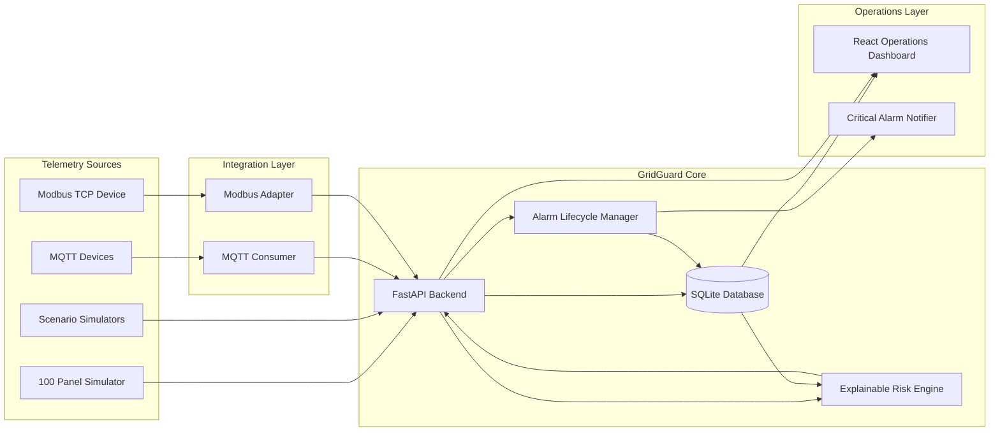
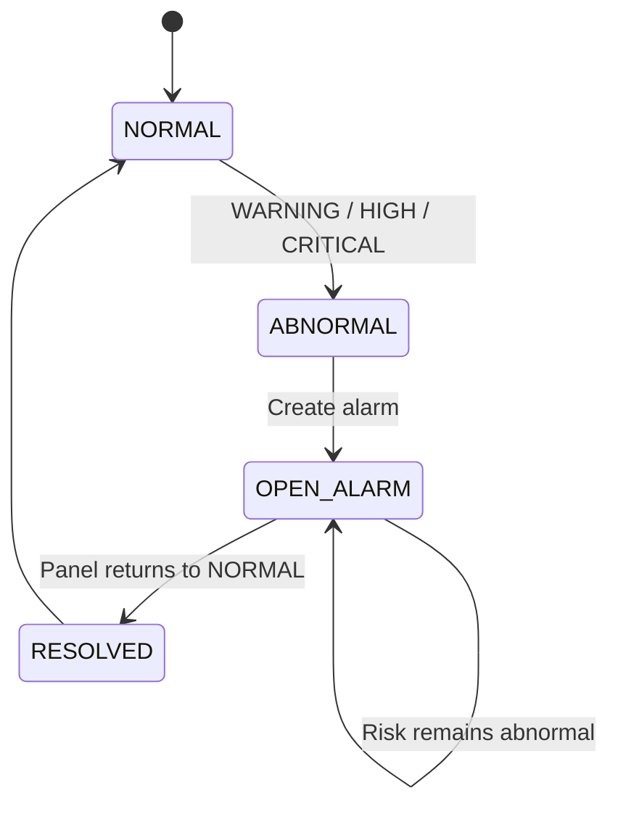

# GridGuard System Architecture

## 1. Purpose

GridGuard is a prototype edge monitoring and early-warning platform designed for low-voltage electrical distribution panels.

Its architecture demonstrates how telemetry can move from simulated or industrial-style data sources through validation, persistent storage, explainable risk analysis, alarm management, live visualization, and external notification systems.

GridGuard is a software engineering prototype and is not intended to replace certified electrical protection equipment.

---

## 2. High-Level Architecture



---

## 3. Telemetry Model

Each telemetry record represents the current condition of one monitored panel.

GridGuard currently evaluates:

- Panel ID
- Timestamp
- Electrical current
- Cable temperature
- Ambient temperature
- Relative humidity
- Partial discharge index
- Arc detection state
- Data quality

Example telemetry flow:

```text
Sensor / Simulator
        ↓
Telemetry Payload
        ↓
FastAPI Validation
        ↓
SQLite Persistence
        ↓
Historical Context
        ↓
Risk Engine
        ↓
Risk Assessment
        ↓
Alarm Synchronization
```

---

## 4. Backend Layer

The backend is implemented with FastAPI.

Main responsibilities include:

- Telemetry ingestion
- Request validation
- Database persistence
- Historical telemetry retrieval
- Risk engine invocation
- Alarm lifecycle management
- Dashboard APIs
- Panel detail APIs
- Health monitoring

The backend acts as the central coordination layer of GridGuard.

---

## 5. Persistence Layer

GridGuard uses SQLite through SQLAlchemy.

The primary runtime entities are:

### Panels

Stores the latest operational state of each registered panel.

### Telemetry

Stores historical sensor measurements.

### Risk Assessments

Stores calculated risk results for each analyzed telemetry event.

### Alarms

Stores abnormal-condition events and their lifecycle state.

An alarm can be:

```text
OPEN
```

or:

```text
RESOLVED
```

Historical alarm records are preserved after recovery.

---

## 6. Explainable Risk Engine

The risk engine is located under:

```text
risk_engine/
```

It evaluates a panel using both the newest telemetry record and historical measurements.

Main analysis dimensions:

```text
Current
Thermal
Environment
Partial Discharge
Arc Detection
```

The engine returns:

```text
risk_score
status
primary_risk
causes
component_scores
metrics
```

This design makes the result explainable instead of returning only an opaque numerical score.

---

## 7. Risk Classification

GridGuard uses four operational states:

```text
0 - 19    NORMAL
20 - 44   WARNING
45 - 74   HIGH
75 - 100  CRITICAL
```

Arc detection is handled separately as an immediate safety-critical override:

```text
ARC detected
    ↓
Risk Score = 100
    ↓
CRITICAL
    ↓
Primary Risk = ARC_FLASH
```

Prototype thresholds are demonstration values and must be calibrated before any real deployment.

---

## 8. Historical Analysis

GridGuard uses recent telemetry history to detect changes that cannot be identified reliably from a single measurement.

Examples include:

- Current deviation from recent baseline
- Cable temperature rise
- Ambient temperature stability
- Partial discharge escalation
- Thermal trend development

Historical telemetry is ordered:

```text
oldest → newest
```

before being sent to the risk engine.

---

## 9. Alarm Lifecycle

The backend automatically synchronizes alarms with current risk conditions.



This prevents the application from creating a new alarm for every telemetry record while the same incident is still active.

---

## 10. Dashboard Architecture

The frontend is implemented using React and Vite.

The dashboard communicates with the FastAPI backend through HTTP APIs.

Primary views include:

- Overview
- Alarm Center
- Panel Monitor
- Panel Detail Drawer

Panel details expose:

- Current telemetry
- Current risk score
- Risk classification
- Primary risk
- Explainable causes
- Component scores
- Active alarm information
- Current trend
- Temperature trend
- Risk-score trend

The dashboard automatically refreshes operational data.

---

## 11. Dashboard API Layer

GridGuard includes dashboard-oriented endpoints designed to reduce frontend processing.

Important endpoints:

```text
GET /dashboard/summary
GET /dashboard/panels
GET /dashboard/panels/{panel_id}/detail
```

The summary API provides:

- Connected panel count
- Active alarm count
- Risk distribution
- Highest-risk panels
- System status

---

## 12. MQTT Integration

GridGuard can ingest telemetry through MQTT.

Development flow:

```text
MQTT Publisher
      ↓
Eclipse Mosquitto
      ↓
gridguard/telemetry/#
      ↓
GridGuard MQTT Consumer
      ↓
FastAPI /telemetry
```

The MQTT consumer includes reconnection behavior and was tested by stopping and restarting the broker.

---

## 13. Modbus TCP Integration

GridGuard also includes a Modbus TCP demonstration.

Architecture:

```text
Simulated PLC
    ↓
Modbus TCP
    ↓
GridGuard Modbus Adapter
    ↓
Telemetry Translation
    ↓
FastAPI /telemetry
```

Development configuration:

```text
Host: 127.0.0.1
Port: 5020
Device ID: 1
```

The adapter converts holding-register values into the standard GridGuard telemetry format.

---

## 14. Critical Notification Integration

Critical alarms can be forwarded to an external webhook.

Flow:

```text
GridGuard Alarm API
        ↓
Critical Alarm Notifier
        ↓
Webhook
        ↓
External Notification System
```

For local development, GridGuard includes a notification receiver.

Default endpoint:

```text
http://127.0.0.1:9001/notify
```

The endpoint may be changed using:

```text
WEBHOOK_URL
```

from the process environment.

---

## 15. Simulation Layer

GridGuard contains several simulators.

### Multi-panel simulator

Produces normal operating telemetry for 100 panels.

### Overheating scenario

Simulates progressive thermal escalation.

### Partial discharge scenario

Simulates progressive PD deterioration.

### Arc scenario

Simulates immediate arc detection.

### Recovery scenario

Returns a panel to normal operating conditions and verifies alarm resolution.

---

## 16. Reliability Design

GridGuard was tested against several failure conditions.

### Backend outage

The dashboard detects backend loss and recovers after backend restart.

### MQTT broker outage

The MQTT client detects disconnection and reconnects when the broker becomes available again.

### Modbus outage

The adapter reports PLC connection failure and succeeds again after the Modbus server returns.

### Backend restart

SQLite preserves telemetry and operational history across backend restarts.

---

## 17. End-to-End Data Flow

A complete abnormal-condition flow is:

```text
Panel / Simulator
      ↓
Telemetry
      ↓
Validation
      ↓
Database
      ↓
Historical Context
      ↓
Risk Engine
      ↓
Risk Score + Explanation
      ↓
Alarm Lifecycle
      ↓
Dashboard
      ↓
Critical Notification
```

A recovery flow is:

```text
Normal telemetry received
        ↓
Risk becomes NORMAL
        ↓
Existing OPEN alarm found
        ↓
Alarm marked RESOLVED
        ↓
Dashboard updates
```

---

## 18. Prototype Scope

GridGuard demonstrates the software architecture required for:

- Telemetry ingestion
- Historical monitoring
- Explainable anomaly detection
- Risk classification
- Alarm management
- Industrial protocol integration
- Operations visualization
- External event notification

The project does not claim to provide certified protection logic or universally valid electrical thresholds.

A production implementation would require hardware validation, engineering calibration, cybersecurity controls, authentication, redundancy, deployment infrastructure, and relevant electrical safety certification.