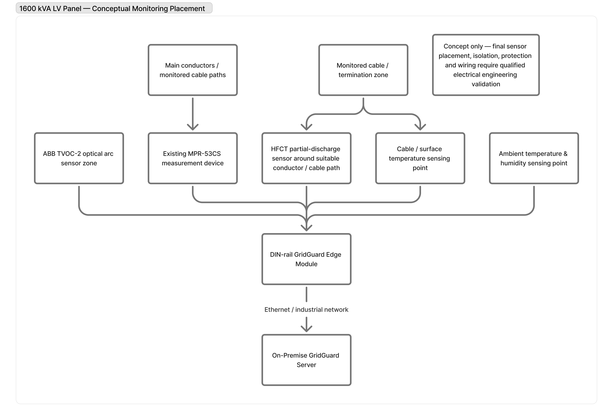
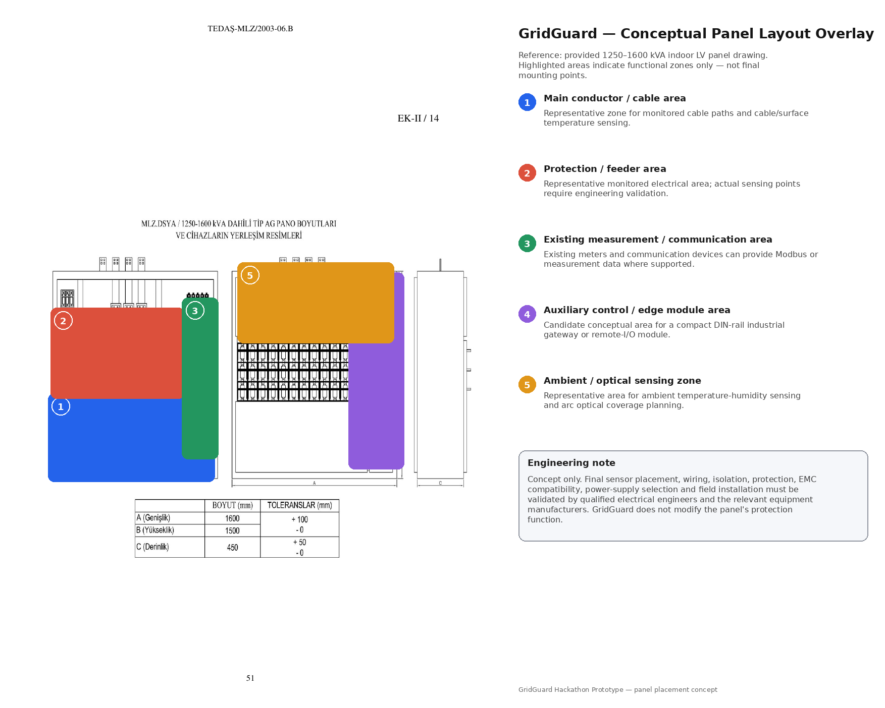
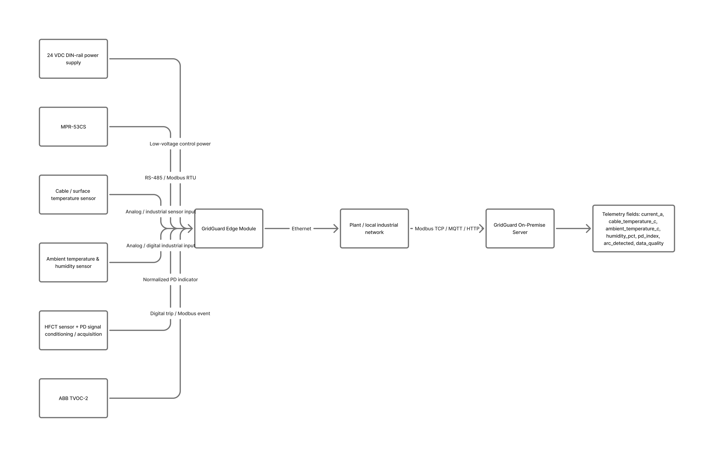
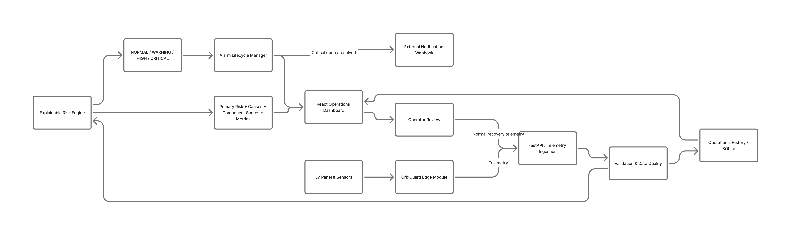

# GridGuard Hardware Concept

## 1. Purpose

This document describes the proposed physical hardware architecture for GridGuard.

GridGuard is currently implemented as a software engineering prototype with:

- live telemetry ingestion,
- deterministic risk analysis,
- AI-assisted early warning,
- alarm management,
- industrial-style MQTT and Modbus integrations,
- and a Digital Panel Twin.

The hardware described in this document is a **conceptual production architecture**.

It has not been electrically certified, installed in a live low-voltage distribution panel, or validated under field conditions.

GridGuard must not be interpreted as a certified electrical protection or autonomous switching system.

---

## 2. Proposed Physical Architecture

A future GridGuard deployment would use sensors installed around a low-voltage electrical distribution panel and a local edge acquisition device.

Conceptual flow:

```text
Electrical Panel
      ↓
Field Sensors
      ↓
GridGuard Edge Module
      ↓
Local Validation / Buffering
      ↓
MQTT / Modbus / Ethernet
      ↓
GridGuard Server
      ↓
Deterministic Risk Engine
      +
GridGuard AI Intelligence
      ↓
Operations Center
      ↓
Alarm / Early-Warning Advisory
```

GridGuard is designed primarily as a monitoring and early-warning platform.

The current prototype does not perform autonomous electrical switching.

---

## 3. GridGuard Edge Module

The proposed **GridGuard Edge Module** acts as the interface between physical panel instrumentation and the GridGuard software platform.

Its conceptual responsibilities include:

- collecting measurements from field sensors,
- timestamping telemetry,
- validating sensor availability,
- assigning data-quality information,
- normalizing measurements,
- temporarily buffering telemetry during communication loss,
- forwarding telemetry to the GridGuard server,
- monitoring communication status,
- recovering automatically after temporary network interruption,
- and exposing local device-health information.

A future industrial version would preferably use a DIN-rail-mounted enclosure suitable for electrical-panel environments.

The Edge Module is currently a proposed architecture and has not yet been implemented as production hardware.

---

## 4. Proposed Edge Module Architecture

The conceptual Edge Module can be represented as:

```text
24 VDC Industrial Power
        ↓
Power / Protection Stage
        ↓
Edge Processing Unit
        │
        ├── Sensor Inputs
        ├── Digital Inputs
        ├── Industrial Communication
        ├── Local Storage / Buffer
        ├── Watchdog / Health Monitor
        └── Status Indicators
        ↓
Ethernet / MQTT / Modbus
        ↓
GridGuard Server
```

A future implementation could include:

- an industrial-capable embedded controller,
- protected sensor interfaces,
- isolated communication interfaces where required,
- Ethernet connectivity,
- RS-485 connectivity,
- non-volatile local storage,
- watchdog functionality,
- status LEDs,
- industrial terminal blocks,
- and a DIN-rail enclosure.

Exact electrical ratings, protection components, isolation distances, PCB design, environmental specifications, and certification requirements must be determined by qualified electrical and hardware engineers.

---

## 5. Sensor Architecture

GridGuard currently processes the following telemetry fields:

```text
current_a
cable_temperature_c
ambient_temperature_c
humidity_pct
pd_index
arc_detected
data_quality
```

A future physical implementation could map these values to the following sensing concepts.

| GridGuard Field | Proposed Measurement Source | Purpose |
|---|---|---|
| `current_a` | Current transformer or industrial current measurement interface | Electrical load monitoring |
| `cable_temperature_c` | Cable or surface temperature sensor | Detect local heating and thermal degradation |
| `ambient_temperature_c` | Panel ambient temperature sensor | Environmental reference |
| `humidity_pct` | Relative humidity sensor | Environmental condition monitoring |
| `pd_index` | HFCT-style partial-discharge sensing chain | Detect abnormal high-frequency discharge activity |
| `arc_detected` | Optical arc sensing input | Rapid detection of an arc-related optical event |
| `data_quality` | Edge-generated health state | Represent trustworthiness of incoming telemetry |

The current GridGuard prototype uses a normalized `pd_index` on a `0–100` scale.

This value must not be interpreted as a calibrated physical partial-discharge measurement unit.

---

## 6. Conceptual Sensor Placement

A simplified monitored electrical path is:

```text
Main Busbar
    ↓
Circuit Breaker
    ↓
Outgoing Feeder
    ↓
Cable / Load Area
```

### Main Busbar Area

Potential monitoring:

- optical arc sensing,
- panel environmental conditions.

### Circuit Breaker / Outgoing Path

Potential monitoring:

- electrical current,
- electrical measurement interface,
- temperature observation where appropriate.

### Outgoing Feeder

Potential monitoring:

- current,
- conductor or cable temperature.

### Cable / Load Area

Potential monitoring:

- cable surface temperature,
- partial-discharge activity,
- environmental conditions.

The exact position and mounting method of every sensor must be determined according to:

- panel geometry,
- equipment type,
- electrical clearances,
- manufacturer recommendations,
- installation safety requirements,
- and applicable standards.

---

## 7. Proposed Sensor / I-O Map

A conceptual GridGuard Edge Module I/O map is shown below.

| Channel | Signal | Proposed Interface | GridGuard Output |
|---|---|---|---|
| AI-01 | Current measurement | Industrial analog / measurement interface | `current_a` |
| TEMP-01 | Cable temperature | Temperature sensor interface | `cable_temperature_c` |
| ENV-01 | Ambient temperature | Environmental sensor | `ambient_temperature_c` |
| ENV-02 | Relative humidity | Environmental sensor | `humidity_pct` |
| PD-01 | Partial-discharge sensing chain | Conditioned HFCT-derived input | `pd_index` |
| DI-01 | Optical arc event | Digital / conditioned detection input | `arc_detected` |
| SYS | Sensor and communication health | Edge-generated state | `data_quality` |

This table represents the **logical interface architecture**.

It is not a finalized electrical schematic.

---

## 8. Data Quality Concept

GridGuard should not assume that every incoming measurement is equally trustworthy.

The current software architecture represents telemetry quality through states such as:

```text
GOOD
DEGRADED
BAD
```

A future physical Edge Module could reduce data quality when:

- a sensor is disconnected,
- measurements are missing,
- samples become stale,
- communication repeatedly fails,
- timing becomes unreliable,
- a value exceeds plausible sensor limits,
- or inconsistent sensor behavior is detected.

Data-quality information would travel together with telemetry.

This allows GridGuard to distinguish between:

```text
Actual Electrical Risk
        vs.
Possible Sensor / Data Problem
```

This distinction is especially important for AI-assisted analysis.

---

## 9. AI Quality Guard Relationship

The GridGuard AI layer includes a Quality Guard.

Its purpose is to prevent unreliable telemetry from being treated as strong AI evidence.

Conceptually:

```text
Incoming Telemetry
        ↓
Data Quality Evaluation
        ↓
Reliable?
   ┌────┴────┐
   │         │
  YES        NO
   │         │
AI Analysis  HOLD / Reduced Trust
```

The AI layer is advisory.

Quality Guard behavior does not replace certified electrical protection systems.

---

## 10. Local Buffering Concept

A future GridGuard Edge Module should continue collecting telemetry during temporary communication interruptions.

Conceptual behavior:

```text
Field Sensors
     ↓
GridGuard Edge
     ↓
Network unavailable
     ↓
Store telemetry locally
     ↓
Retry communication
     ↓
Network restored
     ↓
Forward valid buffered telemetry
```

A production implementation would require explicit policies for:

- buffer capacity,
- storage lifetime,
- write endurance,
- timestamp integrity,
- event ordering,
- duplicate prevention,
- stale-data handling,
- and synchronization after reconnection.

The current software prototype does not claim to provide production-grade field buffering.

---

## 11. Edge Health Monitoring

A future GridGuard Edge Module should monitor its own operating condition.

Potential device-health information includes:

- power status,
- device uptime,
- sensor availability,
- network connectivity,
- local storage health,
- watchdog status,
- last successful server communication,
- telemetry backlog,
- communication retry count.

These states could eventually be displayed separately from electrical panel risk.

This distinction is important because:

```text
Panel Risk ≠ Edge Device Health
```

A communication or sensor failure does not automatically mean that the monitored electrical panel itself is in a dangerous state.

---

## 12. Communication Architecture

The GridGuard software prototype already demonstrates industrial-style integration concepts through MQTT and Modbus TCP.

### MQTT Path

```text
Edge Device
    ↓
MQTT Broker
    ↓
GridGuard MQTT Consumer
    ↓
GridGuard API
    ↓
Risk + AI Analysis
```

MQTT provides a lightweight publish/subscribe architecture suitable for telemetry-oriented systems.

### Modbus TCP Path

```text
Industrial Device / PLC
    ↓
Modbus TCP
    ↓
GridGuard Adapter
    ↓
GridGuard API
    ↓
Risk + AI Analysis
```

Modbus allows GridGuard to conceptually integrate with existing industrial equipment.

### Ethernet

A future Edge Module could use Ethernet as its primary network interface.

The final communication method would depend on:

- installation environment,
- existing industrial infrastructure,
- cybersecurity requirements,
- latency requirements,
- network availability,
- and deployment scale.

---

## 13. Proposed Bill of Materials

The following table represents component categories that could be required for a future GridGuard Edge Module.

It is **not** a finalized procurement list.

| Category | Proposed Component Type | Purpose |
|---|---|---|
| Processing | Industrial-capable embedded processor / controller | Edge acquisition and communication |
| Power | Industrial DC power input stage | Device power |
| Current sensing | CT / current measurement interface | Load monitoring |
| Cable temperature | Industrial temperature sensor | Thermal monitoring |
| Ambient sensing | Temperature / humidity sensor | Environmental monitoring |
| Partial discharge | HFCT-style sensing chain | PD activity monitoring |
| Arc sensing | Optical arc sensor / conditioned input | Arc-event detection |
| Networking | Ethernet interface | Server communication |
| Field communication | RS-485 / industrial communication interface | Existing-system integration |
| Storage | Non-volatile local storage | Temporary telemetry buffering |
| Status | Device status LEDs | Local diagnostics |
| Connectivity | Industrial terminal blocks | Sensor wiring |
| Enclosure | DIN-rail industrial enclosure | Physical installation |
| Protection | Appropriate input/interface protection | Hardware resilience |

Exact components must be selected only after electrical design requirements are finalized.

---

## 14. Failure and Safety Design

GridGuard should degrade predictably when parts of the monitoring chain fail.

| Failure / Condition | Proposed GridGuard Behavior |
|---|---|
| Sensor disconnected | Mark measurement unavailable and reduce data quality |
| Missing measurement | Do not silently invent the sensor value |
| Unreliable telemetry spike | AI Quality Guard withholds strong advisory escalation |
| Network interruption | Edge device should buffer telemetry locally where possible |
| Network recovery | Edge reconnects and forwards valid buffered telemetry |
| MQTT broker interruption | Client retries when broker becomes available |
| Modbus source interruption | Adapter reports communication failure |
| AI unavailable | Deterministic Risk Engine remains available |
| AI disagrees with deterministic CRITICAL | Deterministic CRITICAL takes precedence |
| Confirmed arc input | Deterministic safety logic reports CRITICAL |
| Database/server unavailable | Edge should retain telemetry where practical and retry |
| Invalid telemetry | Server-side validation rejects invalid payloads |
| Edge health problem | System exposes degraded device state |

---

## 15. Safety Hierarchy

GridGuard follows a conceptual safety hierarchy:

```text
Certified Electrical Protection Equipment
                 ↓
Deterministic Safety Evidence
                 ↓
GridGuard Deterministic Risk Engine
                 ↓
GridGuard AI Advisory
                 ↓
Operator Decision Support
```

The AI layer is advisory only.

It must never be interpreted as certified protection logic.

A deterministic CRITICAL condition cannot be downgraded by the AI layer.

GridGuard does not currently perform autonomous switching.

---

## 16. AI and Hardware Relationship

The proposed hardware layer supplies observations.

The AI layer analyzes those observations.

Conceptually:

```text
Physical Condition
       ↓
Sensors
       ↓
GridGuard Edge
       ↓
Telemetry
       ↓
┌───────────────────────────────┐
│ Deterministic Risk Engine     │
│                               │
│ Predictive AI                 │
│ Behavioral Anomaly Detection  │
│ Quality Guard                 │
│ Consensus Layer               │
└───────────────────────────────┘
       ↓
Operator Advisory
```

The AI model does not directly control electrical equipment.

---

## 17. Relationship to the Digital Panel Twin

The GridGuard Operations Center includes a **Digital Panel Twin**.

The Digital Panel Twin is a software representation of the monitored electrical path.

It visualizes:

- Main Busbar,
- Circuit Breaker,
- Outgoing Feeder,
- Cable / Load Area,
- sensor conditions,
- GridGuard Edge status,
- deterministic risk state,
- AI early-warning state,
- and communication flow.

Its purpose is to help an operator connect software telemetry with conceptual physical panel locations.

The Digital Panel Twin is not a validated physical digital twin of a real industrial panel.

It is currently a visualization layer for the GridGuard prototype.

---

## 18. Proposed End-to-End Product Flow

The complete proposed product path is:

```text
LOW-VOLTAGE ELECTRICAL PANEL
            ↓
        FIELD SENSORS
            ↓
   GRIDGUARD EDGE MODULE
            ↓
    MQTT / MODBUS / ETHERNET
            ↓
       GRIDGUARD SERVER
            ↓
 ┌────────────────────────────┐
 │ Deterministic Risk Engine  │
 │ Predictive AI              │
 │ Anomaly Detection          │
 │ Quality Guard              │
 │ Consensus                  │
 └────────────────────────────┘
            ↓
    OPERATIONS CENTER
            ↓
 ┌────────────────────────────┐
 │ Overview                   │
 │ Panel View                 │
 │ Digital Panel Twin         │
 │ AI Timeline                │
 │ Alarm Center               │
 └────────────────────────────┘
            ↓
    OPERATOR DECISION SUPPORT
```

---

## 19. Existing Conceptual Diagrams

The repository includes conceptual diagrams supporting the proposed architecture.

### System Architecture


### Panel Instrumentation Concept



### Panel Layout Overlay



### Sensor I/O Map



### End-to-End Flow



These diagrams are conceptual engineering visualizations.

They must not be interpreted as finalized certified installation drawings.

---

## 20. Safe Physical Demonstration Option

If a physical jury demonstration is later required, GridGuard can use a low-voltage telemetry emulator.

A safe demonstration platform could contain:

- a microcontroller development board,
- potentiometers representing analog sensor values,
- a push button representing arc detection,
- LEDs representing status,
- a breadboard,
- jumper wires,
- and USB low-voltage power.

For example:

```text
Potentiometer 1 → Current
Potentiometer 2 → Cable Temperature
Potentiometer 3 → PD Index
Push Button     → Arc Detection
LEDs            → Device / Risk Status
```

The device would generate telemetry only.

It must be presented as:

> A low-voltage GridGuard telemetry / edge emulator.

It must not be presented as a validated real-panel sensing device.

No mains voltage, high-voltage equipment, or intentional arc generation is required for the GridGuard demonstration.

---

## 21. Current Prototype vs Future Hardware

### Implemented Today

The current GridGuard prototype includes:

- FastAPI telemetry backend,
- SQLite persistence,
- deterministic explainable risk engine,
- alarm lifecycle,
- MQTT telemetry integration,
- Modbus TCP integration,
- external webhook notification,
- XGBoost predictive early warning,
- Isolation Forest anomaly detection,
- AI Quality Guard,
- GridGuard Consensus,
- AI explainability,
- React Operations Center,
- Digital Panel Twin,
- AI Early-Warning Timeline,
- and 100-panel simulation capability.

### Conceptual / Future Work

The following items remain conceptual:

- physical GridGuard Edge Module,
- industrial power design,
- production PCB design,
- real current measurement hardware,
- real thermal-sensing installation,
- real HFCT partial-discharge acquisition chain,
- real optical arc sensing,
- field wiring,
- industrial enclosure validation,
- hardware EMC testing,
- electrical isolation validation,
- sensor calibration,
- industrial field testing,
- and electrical safety certification.

---

## 22. Production Validation Requirements

Before any real electrical-panel deployment, GridGuard would require:

- qualified electrical engineering review,
- hardware design verification,
- sensor calibration,
- electrical isolation assessment,
- EMC testing,
- environmental testing,
- cybersecurity review,
- industrial enclosure validation,
- installation-procedure development,
- failure-mode analysis,
- field testing,
- protection-system coordination,
- maintenance procedures,
- and compliance with applicable standards.

These activities are outside the scope of the current prototype.

---

## 23. Design Principles

The proposed GridGuard hardware architecture follows several design principles.

### Monitoring Before Control

GridGuard is designed as a monitoring and early-warning system before any future control functionality is considered.

### Edge Resilience

Temporary network problems should not immediately cause telemetry loss.

### Explainability

Operators should be able to understand why a risk or AI advisory was produced.

### Safe Degradation

Sensor, network, or AI failures should reduce system confidence rather than silently produce misleading certainty.

### Deterministic Safety Priority

AI cannot override deterministic critical evidence.

### Industrial Integration

The architecture is designed to support integration with common industrial communication approaches.

---

## 24. Current Limitations

The current GridGuard prototype has important limitations.

It has not yet been:

- installed in a real energized distribution panel,
- validated using production industrial sensors,
- calibrated for real partial-discharge measurements,
- electrically certified,
- EMC tested,
- validated under long-term industrial environmental conditions,
- or approved as protection equipment.

AI models are currently trained and evaluated using synthetic prototype telemetry.

Therefore, current performance results represent prototype validation, not field performance.

---

## 25. Final Positioning

GridGuard should currently be described as:

> A functional software prototype for intelligent low-voltage electrical-panel monitoring and early warning, supported by a conceptual edge-hardware architecture and virtual panel representation.

It should not currently be described as:

> A certified electrical protection device.

The objective of the hardware architecture is to demonstrate a credible path from the existing GridGuard software prototype to a future deployable industrial monitoring product.